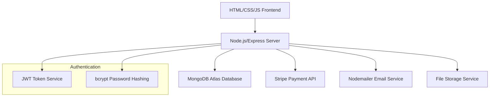

# Design Document

## Overview

The PUBG Tournament Platform is a web-based application that facilitates competitive gaming tournaments. The system follows a modern web architecture with a React frontend, Node.js/Express backend, and PostgreSQL database. The platform integrates with third-party payment gateways and email services to provide a complete tournament management solution.

## Architecture

### System Architecture



### Technology Stack

- **Frontend**: HTML5, CSS3, Vanilla JavaScript (ES6+)
- **Backend**: Node.js with Express.js framework
- **Database**: MongoDB Atlas (cloud database)
- **Authentication**: JWT tokens with bcrypt password hashing
- **Payment**: Stripe API integration via Node.js
- **Email**: Nodemailer for email notifications
- **File Storage**: Local server storage or cloud storage for tournament images/documents
- **Deployment**: Node.js server with MongoDB Atlas connection

## Components and Interfaces

### Frontend Pages and Components

#### HTML Pages
- `index.html`: Homepage with tournament listings
- `login.html`: User login page
- `register.html`: User registration page
- `dashboard.html`: User dashboard
- `tournament-details.html`: Individual tournament page
- `tournament-registration.html`: Tournament registration form
- `admin-dashboard.html`: Admin panel for tournament management
- `create-tournament.html`: Tournament creation form

#### CSS Modules
- `styles/main.css`: Global styles and layout
- `styles/components.css`: Reusable component styles
- `styles/forms.css`: Form styling
- `styles/responsive.css`: Mobile responsiveness

#### JavaScript Modules
- `js/auth.js`: Authentication handling
- `js/tournaments.js`: Tournament data management
- `js/payments.js`: Payment processing
- `js/dashboard.js`: Dashboard functionality
- `js/admin.js`: Admin panel functionality
- `js/utils.js`: Utility functions and API calls

### Backend API Endpoints

#### Authentication Endpoints
- `POST /api/auth/register` - User registration
- `POST /api/auth/login` - User login
- `POST /api/auth/logout` - User logout
- `GET /api/auth/profile` - Get user profile
- `POST /api/auth/refresh` - Refresh JWT token

#### Tournament Endpoints
- `GET /api/tournaments` - List all tournaments
- `GET /api/tournaments/:id` - Get tournament details
- `POST /api/tournaments` - Create tournament (admin only)
- `PUT /api/tournaments/:id` - Update tournament (admin only)
- `DELETE /api/tournaments/:id` - Delete tournament (admin only)

#### Registration Endpoints
- `POST /api/tournaments/:id/register` - Register for tournament
- `GET /api/tournaments/:id/registrations` - Get tournament registrations
- `GET /api/users/:id/registrations` - Get user's registrations

#### Payment Endpoints
- `POST /api/payments/create-intent` - Create Stripe payment intent
- `POST /api/payments/confirm` - Confirm payment
- `POST /api/payments/webhook` - Stripe webhook handler
- `GET /api/payments/:id/status` - Get payment status

## Data Models

### User Schema (MongoDB)
```javascript
const userSchema = {
  _id: ObjectId,
  username: String,
  email: String,
  passwordHash: String,
  gamingProfile: {
    pubgUsername: String,
    skillLevel: String, // 'Beginner' | 'Intermediate' | 'Advanced' | 'Professional'
    preferredGameMode: String
  },
  role: String, // 'Player' | 'Organizer' | 'Admin'
  createdAt: Date,
  updatedAt: Date
}
```

### Tournament Schema (MongoDB)
```javascript
const tournamentSchema = {
  _id: ObjectId,
  name: String,
  description: String,
  gameMode: String,
  maxPlayers: Number,
  entryFee: Number,
  prizePool: Number,
  registrationDeadline: Date,
  startDate: Date,
  endDate: Date,
  status: String, // 'Draft' | 'Open' | 'Full' | 'InProgress' | 'Completed' | 'Cancelled'
  rules: String,
  organizerId: ObjectId,
  createdAt: Date,
  updatedAt: Date
}
```

### Registration Schema (MongoDB)
```javascript
const registrationSchema = {
  _id: ObjectId,
  userId: ObjectId,
  tournamentId: ObjectId,
  registrationDate: Date,
  paymentStatus: String, // 'Pending' | 'Completed' | 'Failed' | 'Refunded'
  paymentId: String,
  teamName: String,
  additionalInfo: String,
  createdAt: Date,
  updatedAt: Date
}
```

### Payment Schema (MongoDB)
```javascript
const paymentSchema = {
  _id: ObjectId,
  registrationId: ObjectId,
  amount: Number,
  currency: String,
  paymentMethod: String,
  stripePaymentIntentId: String,
  status: String, // 'Pending' | 'Succeeded' | 'Failed' | 'Cancelled'
  createdAt: Date,
  updatedAt: Date
}
```

## Error Handling

### Frontend Error Handling
- JavaScript try-catch blocks for API calls
- Form validation with HTML5 validation and custom JavaScript
- Error message display using DOM manipulation
- User feedback through alert messages and inline error displays

### Backend Error Handling
- Express.js error handling middleware
- Input validation using express-validator
- MongoDB error handling with appropriate HTTP status codes
- Payment gateway error handling with retry mechanisms

### Error Response Format
```typescript
interface ErrorResponse {
  success: false;
  error: {
    code: string;
    message: string;
    details?: any;
  };
  timestamp: string;
}
```

## Security Considerations

### Authentication & Authorization
- JWT tokens for user authentication
- Token expiration and refresh mechanism
- Role-based access control using JWT payload
- Password strength requirements and hashing with bcrypt

### Data Protection
- Input sanitization and validation
- SQL injection prevention through parameterized queries
- XSS protection with content security policies
- HTTPS enforcement for all communications

### Payment Security
- PCI DSS compliance through Stripe integration
- No storage of sensitive payment information
- Secure webhook handling for payment confirmations
- Transaction logging for audit trails

## Testing Strategy

### Unit Testing
- Jest for Node.js backend testing
- JavaScript unit tests for frontend functions
- Manual testing for frontend components
- Mock external dependencies (payment gateway, email service)

### Integration Testing
- Supertest for API endpoint testing
- Database integration tests with MongoDB test database
- Payment flow testing with Stripe test mode
- Email service integration testing with Nodemailer

### End-to-End Testing
- Manual testing for full user journey
- Critical path testing (registration → payment → tournament participation)
- Cross-browser compatibility testing (Chrome, Firefox, Safari, Edge)
- Mobile responsiveness testing on different devices

### Performance Testing
- Load testing for concurrent user registrations
- MongoDB query optimization testing
- Payment gateway response time monitoring
- Frontend performance optimization (image compression, CSS/JS minification)

## Deployment and Infrastructure

### Development Environment
- Node.js and npm for local development
- Nodemon for automatic server restart on changes
- Separate MongoDB Atlas cluster for development

### Production Environment
- Node.js hosting (Heroku, DigitalOcean, AWS, etc.)
- MongoDB Atlas production cluster
- SSL certificate for HTTPS
- Environment variables for configuration
- Logging with Winston or similar
- Basic monitoring for uptime and performance

### Deployment Process
- Git-based deployment to hosting platform
- Environment variable configuration
- MongoDB Atlas connection string setup
- Automated deployment with CI/CD or manual deployment
- Testing in staging environment before production